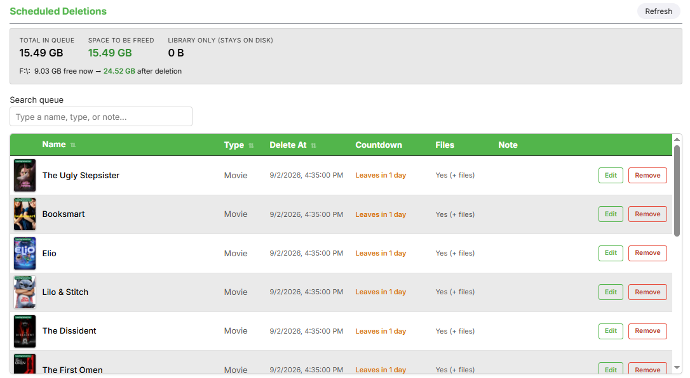

# Emby Expiry

Schedule library items for automatic deletion in Emby. Browse your library, pick movies, series, seasons, or individual episodes, set a date/time, and Emby Expiry removes them automatically when their time is up — from your library, from disk, or both.

## Features

- **Delete queue** — Add any item to the queue with a scheduled deletion date/time, an optional note, and a choice of removing it from the library only or deleting the files from disk as well.
- **Library browser with watch status** — Browse and filter your library (by watched / unwatched / in-progress) directly inside the config page, with inline expansion of series → seasons → episodes so you can queue an entire show or a single episode.
- **Background scheduler** — A configurable check interval (default every 5 minutes) processes the queue and removes items once their scheduled time is reached. Can be paused without clearing the queue.
- **"Leaving Soon" collection sync** — Optionally mirrors the current delete queue into a real, browsable Emby collection (default name "Leaving Soon") that's kept in exact sync as items are queued, un-queued, or deleted.
- **Deletion notifications** — Broadcasts an on-screen message to active sessions when the scheduler deletes something.
- **Playback "leaving soon" alerts** — Optionally notifies whoever is actively watching a queued item (after a configurable number of seconds into playback) that it's about to expire, e.g. "Tron will leave in 5 days." Fires once per viewing.
- **Disk space preview** — See how much space the current queue will free up.

## Requirements

- Emby Server 4.8.11 and above
- 
## Installation

1. Download `EmbyExpiry.dll` from [Releases](../../releases).
2. Copy it into your Emby Server `plugins` folder.
3. Restart Emby Server.
4. Go to **Dashboard → Advanced → Expiry Manager** to configure.

This is a closed-source release — only the compiled DLL is distributed; no source code included.

## Configuration

All settings live under **Dashboard → Advanced → Expiry Manager**:

| Setting | Description |
|---|---|
| Check interval | How often (minutes) the scheduler checks the queue. Default: 5. |
| Scheduler enabled | Turn automatic deletion on/off without clearing the queue. |
| Deletion notifications | Broadcast a message to active sessions when an item is deleted. |
| Add queue to collection | Mirror the queue into a managed Emby collection. |
| Collection name | Name of that collection. Default: "Leaving Soon". |
| Playback leaving-soon notification | Warn active viewers that what they're watching is queued for deletion. |
| Notify trigger (seconds) | How far into playback before that warning fires. |

## Notes

- The plugin's GUID is stable across versions — do not change it if you fork this.
- Deleting "library only" (files left on disk) vs. deleting files is controlled per-item when adding to the queue.
- See [CHANGELOG.md](CHANGELOG.md) for version history.

## License

All rights reserved. This plugin is provided as a compiled binary for personal use; redistribution or modification of the compiled build is not permitted without permission.

## Support

The project is completely free to use. If you'd like to support the development, I've added a voluntary support link:

**Support the project:** http://buymeacoffee.com/amanade3
